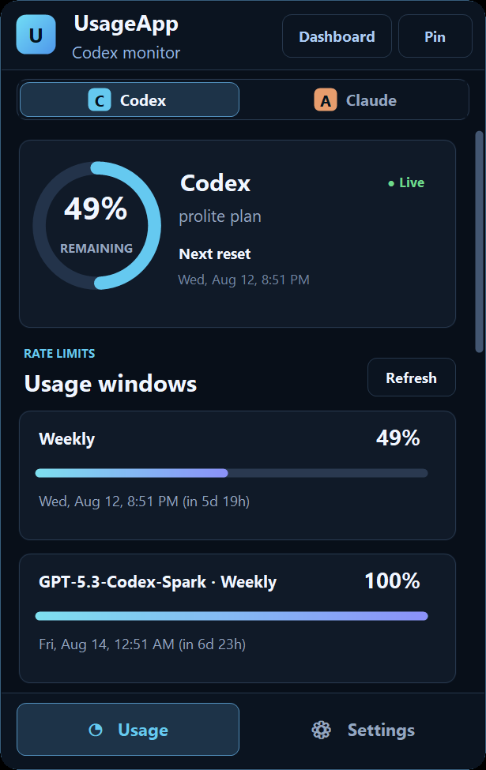
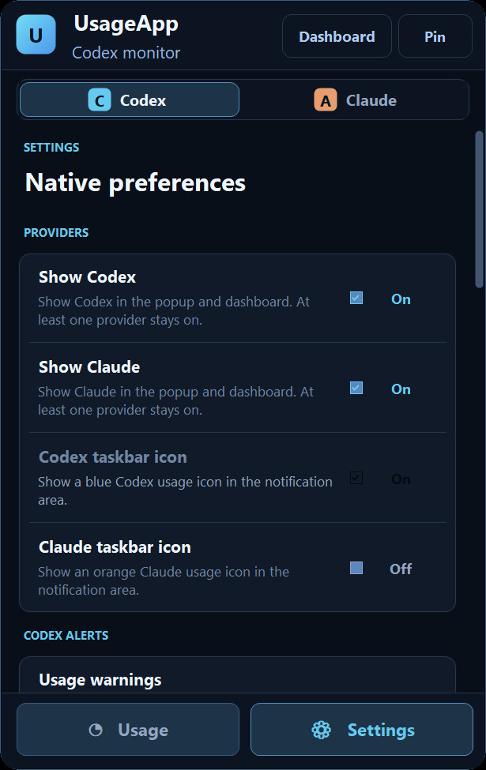

# UsageApp

**A small, read-only Codex usage monitor for the Windows notification area,
with experimental Claude Code support.**

> [!WARNING]
> UsageApp is beta software and may be wrong or stale. Always confirm usage,
> limits, and reset times through the official OpenAI or Anthropic source. Do
> not rely on this app as the ultimate source of truth.

**[Download the Windows x64 beta installer](https://github.com/JeremiahFD/UsageApp/releases/download/v0.2.0-beta.1/UsageApp-0.2.0-beta.1-x64.exe)**

A [portable ZIP](https://github.com/JeremiahFD/UsageApp/releases/download/v0.2.0-beta.1/UsageApp-0.2.0-beta.1-portable-x64.zip)
is also available if local policy blocks the installer.

## What it does

- Shows Codex percentage remaining in a readable taskbar-area number icon
- Opens a compact popup with every returned quota window, reset time, and
  banked-reset expiry
- Includes a dashboard with date filters, available token history, and clear
  last-known timestamps
- Lets you show Codex, Claude, or both; provider switches disappear when only
  one is enabled
- Supports tray number fonts, colors, edge styles, text sizing, notification
  thresholds, refresh timing, startup, and an optional always-on-top popup pin
- Uses a lightweight native Windows build instead of bundling
  Electron/Chromium

## Install

- Tested on Windows 11 x64; Windows 10 x64 is not yet independently tested
- Installer download: about 296 KiB; portable ZIP: about 127 KiB
- Per-user install; administrator access and a restart are not required
- Requires the Codex CLI, or Node.js with `npx` for the pinned official CLI
  fallback
- Unsigned beta: Windows SmartScreen may show an unrecognized-app warning
- No automatic updater yet

Verify downloads with `SHA256SUMS.txt` attached to the release. The earlier
roughly 100 MB Electron Beta 1 download was replaced in place, so there is only
one visible Beta 1 Windows installer.

## Codex and Claude data

Codex quota and optional account-level daily activity come from the documented
local `codex app-server` protocol. UsageApp does not read Codex credential
files, scrape ChatGPT, or call private ChatGPT web endpoints. The official feed
does not currently provide historical model/reasoning attribution, request
counts, or tokens per minute, so those values are shown as unavailable rather
than estimated.

Claude support is **experimental and has not been independently tested against
a subscribed Claude account**. To try it:

1. Enable Claude in UsageApp and choose **Connect Claude**.
2. Close existing Claude Code sessions.
3. Start a new Claude Code session and submit a prompt.
4. Keep UsageApp running while Claude Code emits status-line updates.

Turning Claude on by itself does not create data. This beta accepts quota
values from Claude Code's documented status line; it does not include Claude
history or access Chrome logins, browser cookies, prompts, responses,
credentials, or account tokens. Values may become stale while Claude Code is
idle, so the app shows when they were last known.

The Android companion is still in development and is not included in this
release.

## AI disclosure

UsageApp was created with AI through continuous hands-on feedback, testing,
and iteration by JeremiahFD, not from a single prompt. The code and
documentation may still contain mistakes and should be reviewed like any other
beta project.

## Source, feedback, and license

The native Windows source is in [`apps/windows-native`](apps/windows-native).
The repository also retains the earlier Electron implementation and unfinished
Android companion for reference.

Bug reports are welcome in [Issues](https://github.com/JeremiahFD/UsageApp/issues),
and general feedback belongs in [Discussions](https://github.com/JeremiahFD/UsageApp/discussions).
Please do not post credentials, private logs, or raw provider responses.

UsageApp is free software under the permissive [MIT License](LICENSE). You may
use, modify, distribute, sublicense, or sell copies as long as the copyright
and license notice are retained.
