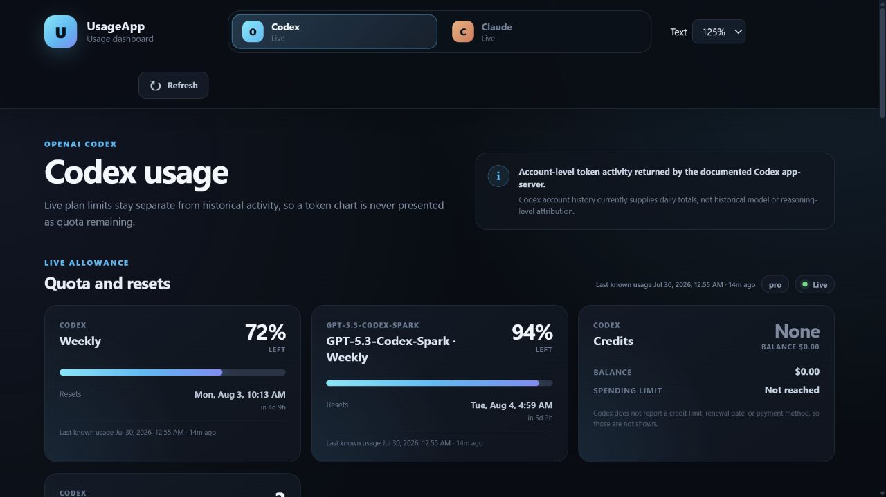
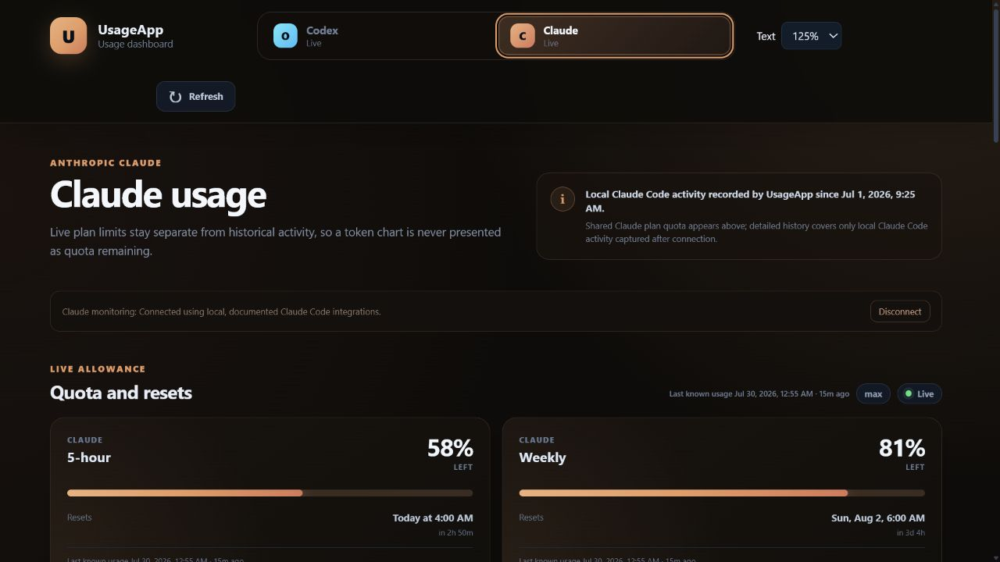
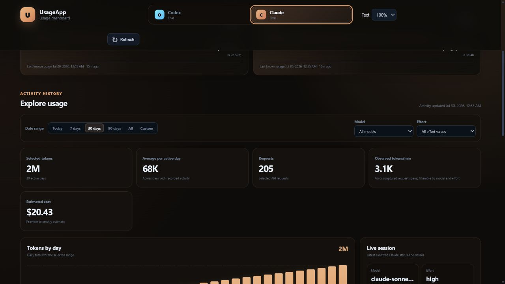
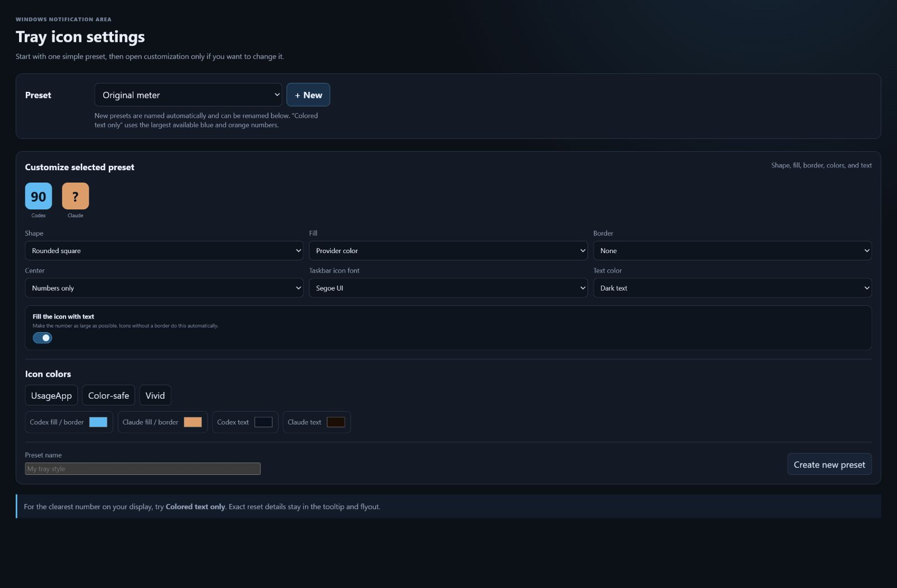
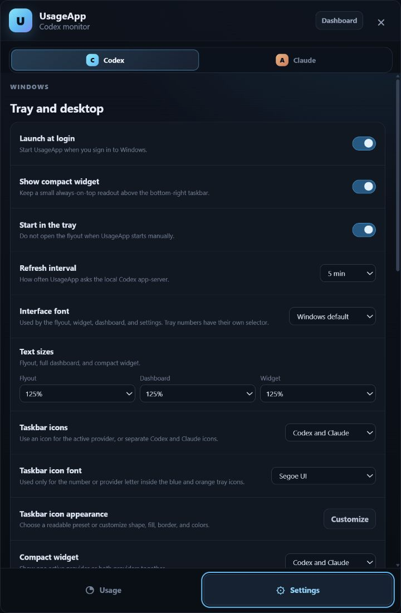

# UsageApp

**Free, privacy-first Codex and Claude usage monitoring in the bottom-right of
your Windows taskbar.**

[](https://github.com/JeremiahFD/UsageApp/releases/tag/v0.2.0-beta.1)
[](LICENSE)


> [!WARNING]
> **UsageApp is beta software.** Expect bugs, incomplete provider data, and
> display differences between Windows systems. The earlier v0.1.0 release was
> also the first public beta and has been relabeled accordingly.

UsageApp keeps live quota windows, remaining percentages, reset times, and
last-known update timestamps visible without leaving an account page open. It
runs quietly in the Windows notification area and never redeems or changes
account limits.

**[Download UsageApp 0.2.0 Beta 1 for Windows x64](https://github.com/JeremiahFD/UsageApp/releases/download/v0.2.0-beta.1/UsageApp-0.2.0-beta.1-x64.exe)**

## Highlights

- Separate blue Codex and orange Claude percentage icons in the Windows tray
- Provider-focused flyouts: the Codex icon opens Codex; Claude opens Claude
- Resizable dashboard with Today, 7-day, 30-day, 90-day, all-time, and custom
  date ranges
- Token graphs, summary cards, tables, tokens/minute, model, and effort filters
  when the provider supplies those dimensions
- Every live usage value includes the exact time it was last known
- All returned quota windows and banked-reset expiration dates are scrollable
- Custom warning thresholds and preset percentage notifications
- Independent interface and taskbar-icon font controls
- Taskbar numbers can use the original pixel styles or real Windows fonts,
  including Segoe UI, Verdana, Tahoma, Arial, Trebuchet MS, Georgia, and
  Consolas
- Editable tray presets with fill, border, text color, and provider colors
- Optional two-provider compact widget above the taskbar

Windows does not allow arbitrary live text inside a pinned taskbar button, so
UsageApp uses the supported notification area at the bottom-right. Windows
controls whether each icon is visible directly or in the overflow menu.

## Screenshots

The screenshots below use synthetic demonstration data. They do not contain
real account information.



<details>
<summary>Claude dashboard and analytics</summary>





</details>

<details>
<summary>Readable tray and interface customization</summary>





</details>

## Download and requirements

- Windows 11, x64
- Codex desktop or Codex CLI for Codex data
- Claude Code for Claude data
- Installer size: approximately 100 MB
- No Windows restart required

The installer is not code-signed, so Windows SmartScreen may show an
unrecognized-app warning. Verify the release asset against the included
`SHA256SUMS.txt` before running it.

### Why is the Windows installer about 100 MB?

UsageApp currently uses Electron. The compiled UsageApp interface and main
process are about 2.14 MB, but the installer must also carry Electron's
Chromium, Node.js, graphics, internationalization, and Windows runtime files.
The previous Beta 1 installer was 99,786,851 bytes after compression.

The size is not caused by the Android build, which is produced separately and
is not included in the Windows EXE. It is also not caused by the taskbar-font
selector: UsageApp reads installed Windows fonts and does not package their
font files.

See [Installer size and future options](docs/INSTALLER_SIZE.md) for the measured
breakdown and possible ways to make a future Windows build smaller.

## What the data means

Codex plan limits come from the documented local `codex app-server` protocol.
Codex activity history currently supplies daily account token totals, but not
historical model or reasoning-level attribution. UsageApp keeps unavailable
filters disabled rather than inventing data.

Claude monitoring is opt-in and uses Claude Code's documented status-line and
OpenTelemetry integrations. Shared plan percentages appear only after an
eligible Claude Code session sends a status-line update. Detailed model,
effort, token, and cost history begins after connection and covers locally
observed Claude Code activity, not complete past account history.

## Android APK

An Android companion APK is being developed, but it is **not included in this
beta release**. The current design receives only a normalized, read-only Codex
snapshot from UsageApp on a trusted private LAN and can retain the last cached
snapshot when Windows is unavailable. It still requires physical-device
pairing, storage, refresh, and revocation testing before public release.

## Privacy

UsageApp does not scrape account websites, call private ChatGPT endpoints, read
credential files, or collect prompts, responses, project files, account IDs,
or access tokens. It contains no advertising or developer analytics SDK.

Phone sharing is off by default. If enabled, only a sanitized, read-only
snapshot is available to paired devices on the local network. See
[PRIVACY.md](PRIVACY.md) for details.

## Free and open source

UsageApp is free software under the permissive [MIT License](LICENSE). You may
use, copy, modify, publish, distribute, sublicense, or sell copies, provided
the copyright and license notice are kept with copies or substantial portions
of the software.

## Source and development

```text
apps/windows/   Electron tray, flyout, dashboard, widget, and phone-sync host
apps/android/   Expo Android companion under development
packages/core/  Shared types, normalization, decoding, and formatting
contracts/      Versioned phone snapshot schema
docs/           Architecture, verification notes, and project images
```

Development requires Node.js 24.3 or newer and pnpm 11:

```powershell
pnpm install
pnpm test
pnpm typecheck
pnpm dev:windows
```

Create a local unsigned Windows installer with:

```powershell
pnpm package:windows
```

The output is written under `apps/windows/release/`. Android native folders are
generated on demand and intentionally are not committed.

Please report beta bugs and readability problems through
[GitHub Issues](https://github.com/JeremiahFD/UsageApp/issues).
