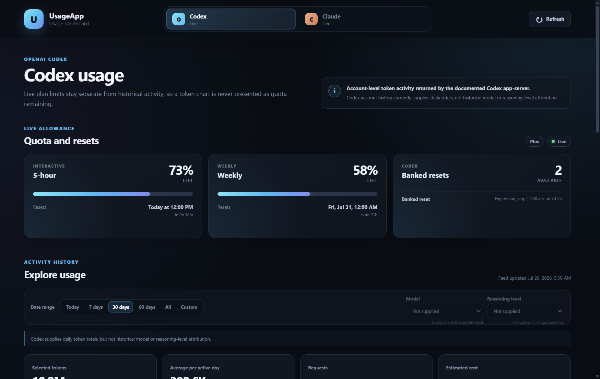
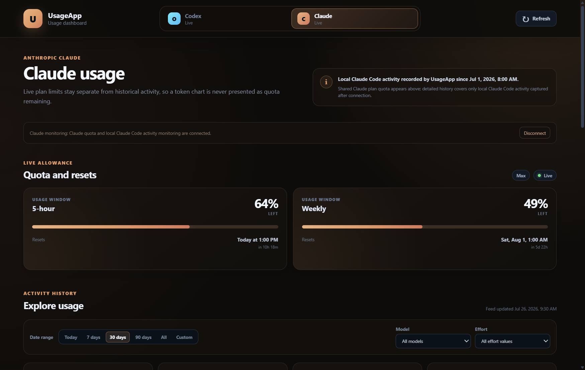

# UsageApp

**Free, privacy-first Codex usage at a glance—right from the bottom-right of
your Windows taskbar.**

[](https://github.com/JeremiahFD/UsageApp/releases/latest)
[](LICENSE)


UsageApp keeps your Codex quota windows, remaining percentages, exact reset
times, and banked-reset expirations visible without leaving a browser page
open. It runs quietly in the Windows notification area and never redeems or
changes your account limits.

**[Download UsageApp 0.1.0 for Windows x64](https://github.com/JeremiahFD/UsageApp/releases/download/v0.1.0/UsageApp-Windows-0.1.0-x64.exe)**

## What you see

- A live percentage icon in the notification area on the Windows taskbar
- A hover tooltip with the most important remaining limits
- A click-open panel with every quota window Codex returns
- Remaining percentages with exact and relative reset times
- Banked-reset counts and expiration dates when available
- An optional always-on-top compact widget above the taskbar
- Optional launch at Windows sign-in

Windows does not allow arbitrary live text inside a pinned taskbar button, so
UsageApp uses the supported notification area at the bottom-right. That gives
you a glanceable percentage icon while keeping the full details one click away.

## Download and requirements

- Windows 11, x64
- Codex desktop or the Codex CLI
- A signed-in Codex account
- Installer size: approximately 100 MB
- No Windows restart required

The installer is not code-signed, so Windows SmartScreen may show an
unrecognized-app warning. Verify this SHA-256 value before running it:

```text
8D2955EC194019163AA84CFFA6FFF32CFF43169172B9B561DF8C310943967146
```

## Next version preview

> [!IMPORTANT]
> These are sanitized screenshots of the **unreleased next version**, not the
> current v0.1 download. The design and features may still change.

The next version is being developed with a resizable full-screen dashboard,
selectable date ranges, graphs, detailed tables, and capability-aware model and
reasoning filters.



<details>
<summary>Claude provider and theme development preview</summary>



</details>

See the [roadmap](ROADMAP.md) for the data-source limitations and privacy
boundaries behind these features.

## Android APK

An installable Android APK is being worked on. The current source includes a
Codex-only Android companion that pairs with UsageApp on Windows over a trusted
private LAN. The APK will remain separate from the Windows installer and will
not require the phone to stay connected to Windows after it has received a
cached snapshot, but fresh account data currently comes from the Windows
collector.

The APK is not part of the public v0.1 release yet. Physical-device pairing,
secure token storage, refresh, caching, and revocation still need release-level
validation.

## Privacy

UsageApp talks to the documented local Codex app-server. It does not scrape the
ChatGPT website, call private ChatGPT backend endpoints, or open Codex
credential files. UsageApp has no analytics or advertising SDK.

Phone sharing is off by default. When enabled, it shares only a sanitized,
read-only usage snapshot with paired devices on the local network. See
[PRIVACY.md](PRIVACY.md) for the complete data-handling summary.

## Free and open source

UsageApp is completely free and released under the permissive
[MIT License](LICENSE). There are no ads, subscriptions, paid unlocks, or
in-app purchases. You may use, copy, modify, and redistribute the source under
the license terms.

## Source and development

```text
apps/windows/   Electron tray, flyout, compact widget, and phone-sync host
apps/android/   Expo Android companion
packages/core/  Shared types, normalization, decoding, and formatting
contracts/      Versioned phone snapshot schema
docs/           Architecture, verification notes, and project images
```

Development requires Node.js 24.3 or newer and pnpm 11:

```powershell
pnpm install
pnpm test
pnpm typecheck
pnpm dev:windows
```

Create a local unsigned Windows installer with:

```powershell
pnpm package:windows
```

The output is written under `apps/windows/release/`. Android native folders are
generated on demand and intentionally are not committed.

Version 0.1.0 is the first public preview. Dashboard and Claude-provider work
is unreleased and remains in private development until it is stable enough to
publish. Please use
[GitHub Issues](https://github.com/JeremiahFD/UsageApp/issues) for bugs and
feature requests.
